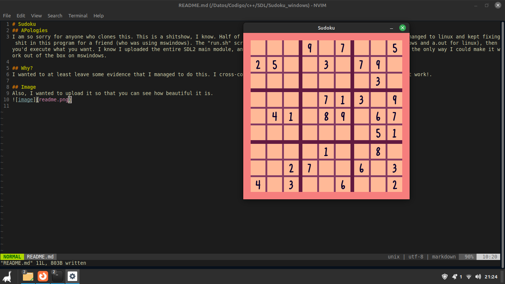
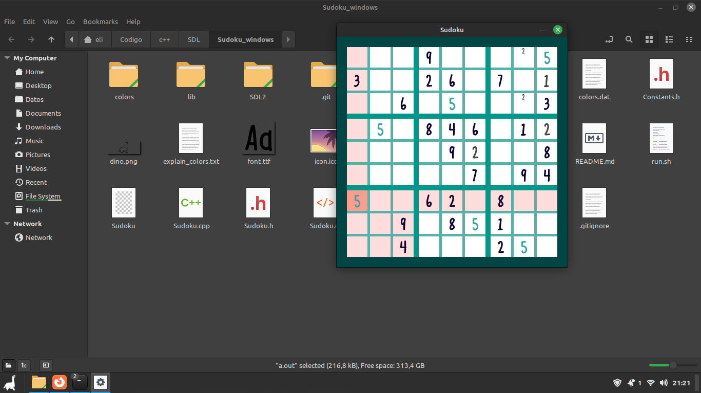

# Sudoku
## APologies
I am so sorry for anyone who clones this. This is a shitshow, I know. Half of this program was developed under mswindows, got bored, changed to linux and kept fixing shit in this program for a friend (who was using mswindows). The "run.sh" script actually compiles both executables (a.exe for mswindows and a.out for linux), then you'd execute what you want. I know I uploaded the entire SDL2 main module, and other compiled libraries (probably piracy); but it was the only way I could make it work out of the box on mswindows.

## Why?
I wanted to at least leave some evidence that I managed to do this. I cross-compiled an SDL2 sudoku from linux to mswindows and made it work!.

## Image
Also, I wanted to upload it so that you can see how beautiful it is.

## Notes
I don't know what half of the files do, let alone if the are _needed_. Left instructions on how to change the colors in "explain\_colors.txt" but in spanish. It shooouuuld not leak memory, but I'm not that sure...

